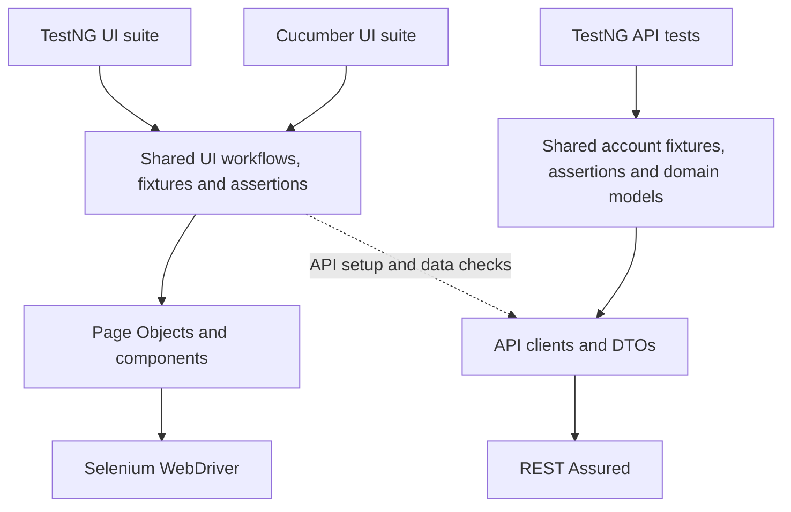

# Automation Exercise

Java test automation for [Automation Exercise](https://automationexercise.com).
REST API tests and two UI test suites, TestNG and Cucumber BDD, share
Page Objects, assertions, account fixtures, configuration, and failure diagnostics.

## Highlights

- All 26 published UI cases implemented in both TestNG and Cucumber.
- 14 REST API tests with reusable clients and DTOs.
- Shared Page Objects, workflows, fixtures and assertions across TestNG and Cucumber.
- Worker-local browser lifecycle and parallel scenario execution.
- Automatic cleanup of test-owned accounts, including failure paths.
- Seed-based replay of randomized test data and product selection.
- Allure business steps, screenshots, browser metadata and API diagnostics.
- Jenkins CI with isolated artifacts and validated test results.

## Demo

[View and reproduce the sample Allure report](examples/allure/README.md):
a successful API request and two deliberate browser failures with screenshots
and diagnostics. The sample is sanitized and reproducible.

## Tech stack

**Language:** Java 17 · **UI:** Selenium WebDriver, TestNG · **BDD:** Cucumber, PicoContainer\
**API:** REST Assured, Jackson · **Test data:** Datafaker · **Reporting:** Allure\
**Build:** Maven Wrapper · **CI:** Jenkins

## Architecture



The TestNG and Cucumber UI test suites reuse the same automation logic. Pages/components own browser
interactions; clients own HTTP requests; shared assertions check domain values.
Configuration, session isolation, cleanup and reporting support both UI test suites.
[Architecture and extension examples](docs/FRAMEWORK.md).

## Test coverage

**14 API tests · 26 TestNG UI tests · 26 published BDD cases.** Cucumber expands
to **37 executable scenarios**: 29 executions of published cases after Scenario
Outline expansion, plus 8 custom executions. Both UI test suites intentionally
cover the same published cases to demonstrate TestNG and Cucumber integration
with the shared framework. [Case IDs, source links and scope](docs/COVERAGE.md).

## Quick start

Use **JDK 17** with `JAVA_HOME` set and internet access. Chrome is the reference
browser for the quick-start commands; Firefox and Edge are also supported.
The Wrapper pins Maven 3.9.16. On Unix it requires a shell, `curl`/`wget` and
`unzip`; on Windows replace `./mvnw` with `mvnw.cmd`.
Run from the repository root, choosing one suite profile per invocation:

```sh
./mvnw clean test -Papi,smoke                 # One read-only API check
./mvnw clean test -Pui,smoke -Dheadless=true   # One TestNG navigation check
./mvnw clean test -Pbdd,smoke -Dheadless=true  # One Cucumber navigation check
./mvnw allure:serve                         # View the latest results
```

Remove `,smoke` for a full suite; `./mvnw clean test` defaults to API only.
Each `clean` replaces previous results. Full suites create synthetic accounts,
submit forms/reviews and place practice orders.
[Prerequisites and test selectors](docs/RUN_GUIDE.md#test-entry-points).

## Configuration

Settings resolve from system properties → environment variables →
[config.properties](src/main/resources/config.properties). Defaults are Chrome,
headed mode and 1920×1080. Select a browser, mode, dimensions or individual case:

```sh
AE_BROWSER=edge AE_HEADLESS=true ./mvnw test -Pui,smoke -Dincognito=true
./mvnw test -Pbdd -Dcucumber.filter.tags=@TC_10 -Dheadless=true
```

[All settings, timeouts, downloads and Firefox macOS launch](docs/RUN_GUIDE.md#browser-launch-settings).

## Parallel execution

Cucumber uses four workers by default (`-DthreadCount=N`). TestNG API/UI methods
are sequential unless given `-Dparallel=methods -DthreadCount=N`; use only the
scenario data provider for BDD. Add `-Dtest.seed=824` to replay generated choices.
[Isolation, replay and cleanup](docs/RUN_GUIDE.md#parallel-execution-and-replay).

## Reports and CI

Allure records business steps, environment/revision metadata and failure evidence.
Use `./mvnw allure:serve` for an interactive report or `./mvnw allure:report` for
HTML under `target/site/allure-maven-plugin`. Report tools are pinned; no global
Allure installation is required. [Report setup and demo](docs/RUN_GUIDE.md#allure-reports).

[Jenkins](Jenkinsfile) runs full API/UI/BDD suites; `SMOKE` selects quick checks.
Failures retain diagnostics and allow remaining suites to run. Each invocation
owns separate logs, metadata, Surefire and Allure artifacts. Local CI equivalents
use `python3 tools/run_ci.py api`, with `ui-smoke`/`bdd-smoke` for browser checks
(Python 3.9+).
[Agent setup, commands and artifact details](docs/RUN_GUIDE.md#continuous-integration).

## Project structure

Java paths below are relative to `com/shangin/automationexercise` in each source root:

```text
src/
├── main/java/
│   ├── config/
│   ├── driver/
│   ├── core/
│   ├── base/
│   ├── pages/
│   ├── components/
│   ├── model/
│   └── support/
└── test/
    ├── java/
    │   ├── tests/
    │   │   ├── api/
    │   │   └── ui/
    │   ├── cucumber/
    │   ├── api/
    │   ├── fixtures/
    │   ├── assertions/
    │   └── factories/
    └── resources/features/
examples/allure/    Sample report inputs and reproduction guide
```

## Documentation

- [FRAMEWORK](docs/FRAMEWORK.md): architecture and extension points.
- [COVERAGE](docs/COVERAGE.md): test mapping, styles and scope.
- [RUN_GUIDE](docs/RUN_GUIDE.md): detailed configuration, selectors, discovery, diagnostics and validation.

## Known limitations

External-site outages, Cloudflare errors and catalog/markup changes can fail tests;
there are no automatic retries. Ad handling modifies selected requests/DOM and is
configurable; Firefox lacks the Chromium request-blocking implementation.

The recorded Java 17/macOS full comparison passed Chrome and Edge **26/26 UI + 35/35 BDD**.
Firefox passed **22/26 UI + 32/35 BDD**, with all seven failures showing Cloudflare
520; smoke modes have execution evidence. These runs covered the then-current
35 BDD executions; two subscription scenarios were added afterward.
Windows/Linux execution remains unverified.
[Exact runs, repeats and browser limitations](docs/RUN_GUIDE.md#compare-complete-browser-runs).

## License

A project license has not been added yet. License selection is tracked in the
repository quality roadmap (private validation notes omitted from public history).
