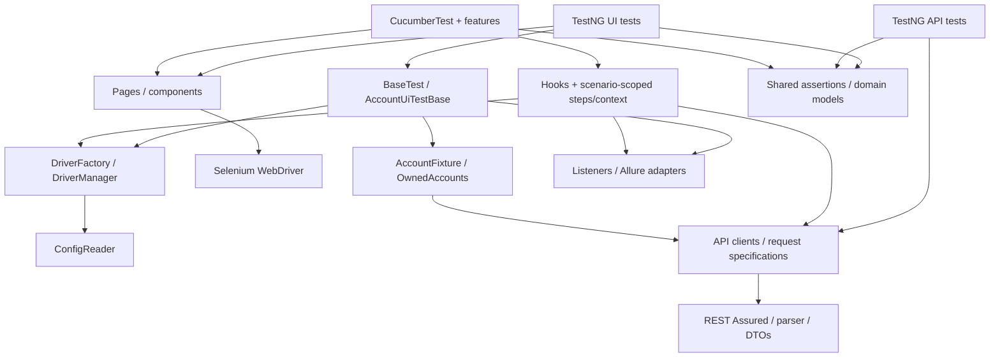

# Framework architecture and extension guide

Start with the [README](../README.md) for Java 17, suite selection, configuration,
parallel execution, Jenkins, and Allure. [Coverage](COVERAGE.md) maps the website's
case IDs to source. Paths below are relative to the repository root; the common
Java package is `com.shangin.automationexercise`.

## Architecture



| Location under the common package | Responsibility and extension point |
| --- | --- |
| `src/main/.../config` | `ConfigReader` resolves and validates system properties, environment variables and file defaults. Add configuration here and document its precedence/default in README. |
| `src/main/.../driver`, `enums/Browser` | `BrowserOptionsFactory` creates browser-specific options; `DriverFactory` initializes the session; `DriverManager` owns worker-local drivers; `DownloadDirectory` owns session directories. A new browser requires all of these contracts and actual configuration/download evidence. |
| `src/main/.../core`, `base` | `AbstractPageObject` captures the current driver and explicit wait; `BasePage` searches the document and exposes shared header/footer; `BaseComponent` searches within its root. Put reusable interaction mechanics here only when multiple objects need them. |
| `src/main/.../pages`, `components` | Pages describe navigation/readiness; components describe reusable regions, cards, rows and modals. Keep selectors and Selenium interactions here. |
| `src/main/.../model`, `support` | Domain values/results, monetary parsing, invocation-local randomness and advertisement handling. |
| `src/test/.../api/clients`, `api/specs` | Endpoint methods use a new request specification and diagnostic filters per request. Return the REST Assured response for assertions; add business-level `@Step` labels here. |
| `src/test/.../api/models`, `api/support`, `mappers` | DTO records model responses; `ApiResponseParser` handles this site's HTML-labelled JSON using Jackson; mappers translate domain users/products. Assert HTTP status separately from the JSON `responseCode`. |
| `src/test/.../fixtures`, `base`, `api/support/OwnedAccounts` | `AccountFixture` composes account creation/ownership/cleanup. Browser-only tests extend `BaseTest`; account UI/API tests opt into `AccountUiTestBase`/`AccountTestBase`. |
| `src/test/.../assertions`, `constants`, `formatters` | Shared domain assertions, messages and address formatting. Keep expectations separate from navigation; use `MonetaryValues` for price arithmetic. |
| `src/test/.../factories`, `testdata`, `resources` | Generated synthetic data, expected category values, upload resources and completed-download reading. |
| `src/test/.../steps` | Reusable Java workflows such as `ApiUserSteps`, `UserSteps` and `UiProductSteps`; these are distinct from Gherkin bindings. |
| `src/test/.../cucumber` | Runner, tagged browser hooks, account/random lifecycle hooks, step bindings and `ScenarioContext`. PicoContainer shares constructor-injected objects within one scenario, never across scenarios. |
| `src/test/.../listeners` | TestNG failure capture and Allure environment/revision metadata. Allure lifecycle fallback registration lives in `src/test/resources/META-INF/services`. |
| `pom.xml`, `Jenkinsfile`, `tools/run_ci.py` | Maven suite selection, adapters/AspectJ, CI invocation isolation and result validation. Support regressions under `tests/support` are selected explicitly, outside normal API/UI/BDD profiles. |

The project supplies the configuration policy, page/component abstraction,
readiness and ad workarounds, session/download ownership, account cleanup,
assertions, seed replay, failure collection and CI evidence validation. Selenium
provides WebDriver, waits, actions and Selenium Manager; TestNG provides test
lifecycle/assertions and data providers; Cucumber provides Gherkin/glue/hooks;
PicoContainer provides scenario dependency injection; REST Assured supplies HTTP
requests; Jackson maps JSON; Datafaker generates data; Allure adapters and
AspectJ collect results/steps and build reports. These libraries are integrated,
not reimplemented. Dependency versions are pinned in [pom.xml](../pom.xml).

## Execution and ownership

A TestNG UI method starts invocation randomness and publishes a configured
browser in `BaseTest.setup()`. Page objects obtain that worker's driver when
constructed: create them after setup, and never keep an object from an earlier
browser session. An account-enabled subclass cleans owned accounts before the
base browser teardown; failure evidence is captured before teardown. The driver
and random state are cleared even when teardown fails. Catalog API tests have
no browser fixture; API account tests use `AccountTestBase`.

`CucumberTest` discovers features under `src/test/resources/features` and glue
under `cucumber`; its parallel data provider schedules scenarios. The earliest
Before hook starts randomness; `@ui` creates the browser. After hooks run in
descending order: metadata (3), failed-browser evidence (2), browser shutdown (1),
account cleanup (0), random-state clearing (minimum integer). Account cleanup
runs regardless of `@user`; that tag is a selector, not ownership authorization.

Store user, modal and expected-product state in constructor-injected
`ScenarioContext`. New scenario state belongs there or in another injected
scenario-scoped object, never static fields. Reuse existing bindings before
adding a phrase; duplicate matching expressions make glue ambiguous.

Always obtain a fresh owned identity **before** creation:
`accounts.newUser()` for UI registration, `accounts.createUser()` for API setup,
or `context.newUser()`/injected `ApiUserSteps.createUser()` in BDD. Setting an
arbitrary user on the context does not register ownership. Cleanup validates
both deletion and an independent lookup; preserve the original failure when
cleanup also fails. See [account cleanup](RUN_GUIDE.md#test-account-cleanup).

## Add a page and component

Use [TestCasesPage](../src/main/java/com/shangin/automationexercise/pages/TestCasesPage.java)
and [FooterComponent](../src/main/java/com/shangin/automationexercise/components/FooterComponent.java)
as minimal existing examples. The following alternative catalog wrapper shows
where to place a new page and a locator-root component. It uses existing site
selectors; choose distinctive readiness controls for a different page.

Save each class in its named file under `src/main/java/com/shangin/automationexercise`:

```java
package com.shangin.automationexercise.components;

import org.openqa.selenium.By;
import com.shangin.automationexercise.base.BaseComponent;

public class CatalogHeadingComponent extends BaseComponent {
    public CatalogHeadingComponent(By root) {
        super(root);
    }

    public String title() {
        return getText(By.cssSelector("h2.title"));
    }
}
```

```java
package com.shangin.automationexercise.pages;

import java.net.URI;
import org.openqa.selenium.By;
import com.shangin.automationexercise.base.BasePage;
import com.shangin.automationexercise.components.CatalogHeadingComponent;
import com.shangin.automationexercise.config.ConfigReader;
import com.shangin.automationexercise.driver.DriverManager;

public class CatalogExamplePage extends BasePage {
    private static final By ROOT = By.cssSelector(".features_items");
    private static final By TITLE = By.cssSelector(".features_items h2.title");

    public static CatalogExamplePage open() {
        String url = URI.create(ConfigReader.getBaseUrl()).resolve("/products").toString();
        DriverManager.getDriver().get(url);
        CatalogExamplePage page = new CatalogExamplePage();
        page.waitUntilLoaded();
        return page;
    }

    public CatalogHeadingComponent heading() {
        return new CatalogHeadingComponent(ROOT);
    }

    @Override
    public boolean isLoaded() {
        return isDisplayed(TITLE);
    }

    @Override
    public void waitUntilLoaded() {
        removeAds();
        waitUntilVisible(TITLE);
    }
}
```

Expose shared regions through a page accessor and return a ready destination
from navigation methods, as `HeaderComponent.openProducts()` does. Use inherited
`click`, `type` and wait helpers rather than sleeps. Locator-root components
re-resolve replaced containers; `WebElement` constructors are appropriate for
identity-bearing items such as one cart row. Reacquire item snapshots after DOM
replacement. Keep business assertions in tests/shared assertion classes.

An optional TestNG example goes in
`src/test/java/com/shangin/automationexercise/tests/ui/products/CatalogExampleTest.java`:

```java
package com.shangin.automationexercise.tests.ui.products;

import org.testng.Assert;
import org.testng.annotations.Test;
import com.shangin.automationexercise.base.BaseTest;
import com.shangin.automationexercise.pages.CatalogExamplePage;

@Test(groups = "ui")
public class CatalogExampleTest extends BaseTest {
    @Test
    public void shouldShowCatalogHeading() {
        Assert.assertEquals(CatalogExamplePage.open().heading().title(), "ALL PRODUCTS");
    }
}
```

```sh
./mvnw test -Pui -Dtest=CatalogExampleTest -Dbrowser=chrome -Dheadless=true
```

This is a learning example; extend the existing `ProductsPage` for real catalog
coverage instead of retaining two page objects for the same region.

## Add an API test

Put endpoint operations in `api/clients`, reuse `ApiSpecifications.defaultRequest()`
or `formRequest()`, and add DTO records for new response fields. Put the test
under `tests/api` with a name ending in `Test` for default/profile discovery.
For a read-only test no account base class is needed. This complete example
uses the existing client/parser/DTO/assertion rather than duplicating HTTP setup:

```java
package com.shangin.automationexercise.tests.api;

import org.testng.Assert;
import org.testng.annotations.Test;
import io.qameta.allure.Feature;
import io.restassured.response.Response;
import com.shangin.automationexercise.api.clients.ProductsApiClient;
import com.shangin.automationexercise.api.models.ProductDto;
import com.shangin.automationexercise.api.support.ApiResponseParser;
import com.shangin.automationexercise.assertions.ProductApiAssertions;

@Feature("Product search")
@Test(groups = "api")
public class ProductSearchExampleTest {
    @Test
    public void shouldFindTshirts() {
        Response response = new ProductsApiClient().postSearchProducts("tshirt");
        Assert.assertEquals(response.statusCode(), 200, "Unexpected HTTP status");
        Assert.assertEquals(ApiResponseParser.extractJson(response)
                .get("responseCode").asInt(), 200, "Unexpected application code");
        ProductApiAssertions.assertValidSearchProducts(
                ApiResponseParser.extractList(response, "products", ProductDto.class), "tshirt");
    }
}
```

Save it as `tests/api/ProductSearchExampleTest.java` under the common test package:

```sh
./mvnw test -Papi -Dtest=ProductSearchExampleTest
```

For account endpoints extend `AccountTestBase` and create identities through its
fixture. Add negative-path assertions for both transport status and application
code/message; this site can return HTTP 200 with a failing JSON `responseCode`.

## Add a Cucumber scenario

Place a `.feature` under `src/test/resources/features`. Tag browser scenarios
`@ui` to enable driver hooks; use a unique `@MTC_*` for an extra scenario and
reserve `@TC_*` for the actual website case. Add `@smoke` only intentionally,
since it changes the smoke suite and documented counts. This example reuses
existing navigation/product bindings and requires no new Java glue:

```gherkin
@ui @MTC_003
Feature: Catalog search example

  Scenario: Find tshirts in the catalog
    Given the home page is opened
    When the user opens the Products page from the header
    And the user searches for "tshirt"
    Then the search results should be displayed
    And all displayed products should match "tshirt"
```

```sh
./mvnw test -Pbdd -Dcucumber.filter.tags=@MTC_003 -Dcucumber.execution.dry-run=true \
  -Dallure.results.directory=target/example-discovery/allure-results \
  -Dtest.reports.directory=target/example-discovery/surefire-reports
./mvnw test -Pbdd -Dcucumber.filter.tags=@MTC_003 -Dbrowser=chrome -Dheadless=true \
  -Dallure.results.directory=target/example-execution/allure-results \
  -Dtest.reports.directory=target/example-execution/surefire-reports
```

For a new action add a uniquely matching `@Given`, `@When` or `@Then` method under
`cucumber/steps`, delegate interactions to page objects, and constructor-inject
`ScenarioContext` when state crosses bindings. Existing
[ProductsSteps](../src/test/java/com/shangin/automationexercise/cucumber/steps/ProductsSteps.java)
and [AccountSteps](../src/test/java/com/shangin/automationexercise/cucumber/steps/AccountSteps.java)
show state/assertions and owned account setup. Dry-run checks glue resolution;
only the second command executes the site. Keep those results separate.

After adding tests, update [coverage](COVERAGE.md) and README discovery counts.
Run focused checks, then the affected real suite with fresh report directories.
Do not commit the duplicate learning examples solely to inflate coverage.
